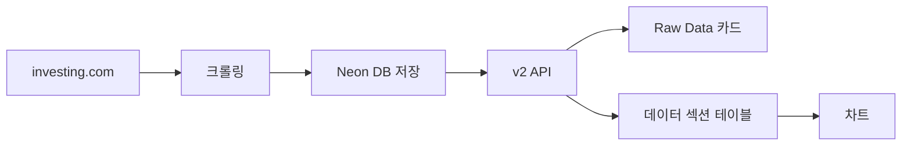

# 경제지표 추가 표준 가이드

## 개요
Investment App에 새로운 경제지표를 추가하는 표준 절차를 정의합니다.

## 시스템 아키텍처

### 데이터 흐름


### 핵심 원칙
1. **실시간 크롤링** → **데이터베이스 저장** → **빠른 조회**
2. **표준 4단계 절차** 순차 진행
3. **ADR 준수** (API 구조, 데이터 처리)

## 표준 4단계 구현 절차

### 1단계: 백엔드 크롤링 모듈 구현

#### 1.1 크롤러 파일 생성
```python
# 파일: backend/crawlers/{indicator_name}.py
from .investing_crawler import fetch_html, parse_history_table, extract_raw_data

def get_{indicator_name}_data():
    """Get {Indicator Name} data from investing.com"""
    try:
        url = "https://www.investing.com/economic-calendar/{url-slug}"

        # Step 1: Fetch HTML
        html = fetch_html(url)

        # Step 2: Parse History Table
        rows = parse_history_table(html)

        # Step 3: Extract Raw Data
        raw_data = extract_raw_data(rows)

        return raw_data

    except Exception as e:
        return {"error": f"Crawling failed: {str(e)}"}
```

#### 1.2 Import 추가
```python
# 파일: backend/app.py
from crawlers.{indicator_name} import get_{indicator_name}_data
```

#### 1.3 API 엔드포인트 추가
```python
# 파일: backend/app.py

@app.route('/api/rawdata/{indicator-slug}')
def get_{indicator_name}_rawdata():
    try:
        data = get_{indicator_name}_data()
        if "error" in data:
            return jsonify({
                "status": "error",
                "message": data["error"]
            }), 500
        return jsonify({
            "status": "success",
            "data": data,
            "source": "investing.com",
            "indicator": "{Indicator Display Name}"
        })
    except Exception as e:
        return jsonify({
            "status": "error",
            "message": f"Internal server error: {str(e)}"
        }), 500

@app.route('/api/history-table/{indicator-slug}')
def get_{indicator_name}_history():
    try:
        url = "https://www.investing.com/economic-calendar/{url-slug}"
        html_content = fetch_html(url)
        if html_content:
            history_data = parse_history_table(html_content)
            if history_data:
                return jsonify({
                    "status": "success",
                    "data": history_data,
                    "indicator": "{Indicator Display Name}",
                    "source": "investing.com"
                })
        return jsonify({"status": "error", "message": "Failed to fetch {indicator} history data"})
    except Exception as e:
        return jsonify({"status": "error", "message": str(e)})
```

#### 1.4 CrawlerService 설정 업데이트
```python
# 파일: backend/services/crawler_service.py

INDICATOR_URLS = {
    # 기존 지표들...
    '{indicator-id}': 'https://www.investing.com/economic-calendar/{url-slug}'
}

name_mapping = {
    # 기존 지표들...
    '{indicator-id}': '{Indicator Display Name}'
}
```

### 2단계: Raw Data 카드 연동

**v2 API 자동 처리**: 별도 구현 불필요
- `fetchAllIndicatorsFromDB()` 함수가 자동으로 처리
- 데이터베이스에 저장되면 카드 자동 표시

### 3단계: 데이터 섹션 테이블 연동

```typescript
// 파일: frontend/src/components/DataSection.tsx

const [tabsData, setTabsData] = useState<TabData[]>([
  // 기존 지표들...
  {
    id: '{indicator-id}',
    name: '{Indicator Display Name}',
    data: [],
    loading: false
  }
]);
```

### 4단계: 차트 구현

**자동 처리**: 별도 구현 불필요
- 기존 `DataCharts` 컴포넌트가 자동으로 처리

## 검증 절차

### 로컬 테스트
```bash
# 1. 크롤링 테스트
curl http://localhost:5001/api/rawdata/{indicator-slug}

# 2. History Table 테스트
curl http://localhost:5001/api/history-table/{indicator-slug}

# 3. 수동 데이터베이스 저장
curl -X POST http://localhost:5001/api/v2/crawl/{indicator-id}

# 4. v2 API 확인
curl http://localhost:5001/api/v2/indicators/{indicator-id}
curl http://localhost:5001/api/v2/indicators | jq '.indicators | length'
```

### 배포 후 테스트
```bash
# 1. 프로덕션 크롤링 테스트
curl https://investment-app-backend-x166.onrender.com/api/rawdata/{indicator-slug}

# 2. 수동 데이터베이스 저장
curl -X POST https://investment-app-backend-x166.onrender.com/api/v2/crawl/{indicator-id}

# 3. v2 API 확인
curl https://investment-app-backend-x166.onrender.com/api/v2/indicators | jq '.indicators | length'
```

## 데이터 형식별 처리

### 숫자 데이터 (예: PMI)
```json
{
  "actual": 48.7,
  "forecast": 49.0,
  "previous": 48.0
}
```
- 서프라이즈 계산: `actual - forecast`

### 퍼센트 데이터 (예: GDP, Industrial Production)
```json
{
  "actual": "3.3%",
  "forecast": "3.0%",
  "previous": "-0.5%"
}
```
- 문자열로 저장, 차트에서 숫자 변환
- 서프라이즈 계산: `parsePercentValue()` 사용

### forecast 없는 데이터 (예: Industrial Production YoY)
```json
{
  "actual": "0.87%",
  "forecast": null,
  "previous": "1.27%"
}
```
- 서프라이즈 = null, 카드에서 "-" 표시

## 네이밍 규칙

### ID 규칙
- URL slug 기반: `industrial-production`, `gdp`, `retail-sales`
- 하이픈 사용, 소문자

### 파일명 규칙
- 크롤러: `{indicator_name}.py` (언더스코어)
- 함수: `get_{indicator_name}_data()`

### 표시명 규칙
- 공식 명칭 사용: "GDP QoQ", "ISM Manufacturing PMI"
- 단위 포함: "Industrial Production YoY"

## 문제 해결 가이드

### 카드가 표시되지 않는 경우
1. v2 API 응답 확인: `curl /api/v2/indicators`
2. 개별 지표 확인: `curl /api/v2/indicators/{indicator-id}`
3. CrawlerService 설정 확인
4. 수동 크롤링 실행: `curl -X POST /api/v2/crawl/{indicator-id}`

### CORS 오류 발생 시
```python
# backend/app.py CORS 설정 확인
CORS(app,
     origins=["https://investment-app-rust-one.vercel.app", "http://localhost:3000"],
     methods=['GET', 'POST', 'OPTIONS'],
     allow_headers=['Content-Type', 'Authorization'])
```

### 업데이트 버튼에서 제외되는 경우
```python
# CrawlerService.INDICATOR_URLS에 추가 확인
# update_all_indicators() 함수 로직 확인
```

## 체크리스트

### 구현 완료 체크리스트
- [ ] 크롤러 파일 생성
- [ ] app.py import 추가
- [ ] API 엔드포인트 2개 추가 (/rawdata, /history-table)
- [ ] CrawlerService 설정 업데이트 (URL, 이름)
- [ ] DataSection.tsx 탭 추가
- [ ] 로컬 테스트 통과
- [ ] Git commit & push
- [ ] 배포 후 수동 데이터 저장
- [ ] 프론트엔드 카드/테이블/차트 확인

### ADR 준수 체크리스트
- [ ] ADR-003: 4단계 표준 절차 준수
- [ ] ADR-007: 표준 API 응답 구조 사용
- [ ] ADR-005: % 데이터 처리 규칙 적용
- [ ] ADR-008: 서프라이즈 계산 표준화 적용

## 예시: 완전한 구현 사례

### GDP QoQ 지표 (참조용)

**1단계: 백엔드**
```python
# backend/crawlers/gdp.py
from .investing_crawler import fetch_html, parse_history_table, extract_raw_data

def get_gdp_data():
    """Get GDP QoQ data from investing.com"""
    try:
        url = "https://www.investing.com/economic-calendar/gdp-375"
        html = fetch_html(url)
        rows = parse_history_table(html)
        raw_data = extract_raw_data(rows)
        return raw_data
    except Exception as e:
        return {"error": f"Crawling failed: {str(e)}"}
```

**CrawlerService 설정**
```python
INDICATOR_URLS = {
    'gdp': 'https://www.investing.com/economic-calendar/gdp-375'
}

name_mapping = {
    'gdp': 'GDP QoQ'
}
```

**3단계: 프론트엔드**
```typescript
{
  id: 'gdp',
  name: 'GDP QoQ',
  data: [],
  loading: false
}
```

**최종 결과**: Raw Data 카드 + 데이터 섹션 테이블 + 차트 모두 정상 작동

---

**작성일**: 2025-09-18
**버전**: 1.0
**다음 업데이트**: 새로운 지표 추가 시