# 가계부/지출관리 시스템 구현 계획

## 개요
포트폴리오 관리 시스템의 아키텍처와 패턴을 재사용하여 완전한 가계부/지출관리 시스템 구현

## 시스템 아키텍처

### 데이터 흐름

```mermaid
graph LR
    A[거래 입력] --> B[React Form]
    B --> C[Flask API]
    C --> D[PostgreSQL DB]
    D --> E[가계부 대시보드]
    E --> F[예산 관리]
    F --> G[통계 분석]
```


### 기술 스택
- **Frontend**: Next.js 15.5.3, React, Tailwind CSS, Recharts
- **Backend**: Python Flask, PostgreSQL (Neon.tech)
- **State Management**: React useState
- **API Communication**: Fetch API
- **패턴 재사용**: 포트폴리오 시스템의 CRUD/대시보드 패턴

## 핵심 기능 정의 (MVP)

### 1. 거래내역 관리 시스템 (CRUD)

#### 1.1 거래 데이터 구조
```sql
CREATE TABLE IF NOT EXISTS expenses (
    id SERIAL PRIMARY KEY,
    user_id INTEGER REFERENCES users(id),
    transaction_type VARCHAR(10) NOT NULL CHECK (transaction_type IN ('수입', '지출')),
    amount NUMERIC NOT NULL,
    category VARCHAR(50) NOT NULL,          -- 대분류
    subcategory VARCHAR(50) NOT NULL,       -- 소분류
    description TEXT,                       -- 상세 설명/메모
    payment_method VARCHAR(30),             -- 현금/카드/계좌이체/기타
    transaction_date DATE NOT NULL,
    created_at TIMESTAMP DEFAULT CURRENT_TIMESTAMP,
    updated_at TIMESTAMP DEFAULT CURRENT_TIMESTAMP
);
```

#### 1.2 2단계 카테고리 시스템 (포트폴리오 패턴 재사용)
```typescript
// 포트폴리오의 자산 카테고리 시스템과 동일한 구조
const expenseCategories = {
  "생활비": ["식비", "교통비", "의료비", "생필품"],
  "주거비": ["월세/관리비", "공과금", "인터넷", "보험"],
  "여가비": ["외식", "쇼핑", "문화생활", "여행"],
  "교육비": ["도서", "강의", "자격증", "학원"],
  "기타": ["경조사", "기부", "미분류"]
};

const incomeCategories = {
  "근로소득": ["급여", "보너스", "부업"],
  "사업소득": ["사업수익", "프리랜서"],
  "투자소득": ["배당금", "이자", "투자수익"],
  "기타소득": ["용돈", "선물", "환급"]
};
```

### 2. 실시간 대시보드 (포트폴리오 패턴 확장)

#### 2.1 월간 요약 카드 (4개)
```typescript
// 포트폴리오 요약카드와 유사한 구조
interface MonthlySummary {
  totalIncome: number;      // 총 수입
  totalExpense: number;     // 총 지출
  netAmount: number;        // 순 수입 (수입-지출)
  budgetRemaining: number;  // 예산 잔여
}
```

#### 2.2 카테고리별 지출 차트
- **도넛 차트**: 카테고리별 지출 비중 (Recharts 재사용)
- **막대 차트**: 카테고리별 지출 금액 (Recharts 재사용)
- **선형 차트**: 일별/주별 지출 트렌드

#### 2.3 거래내역 테이블 (포트폴리오 자산 테이블 패턴)
- **카테고리별 그룹화**: 2단계 중첩 구조 (대분류 > 소분류 > 거래내역)
- **정렬/필터링**: 날짜, 금액, 카테고리별
- **CRUD 기능**: 수정/삭제 모달 (포트폴리오와 동일)

### 3. 예산 관리 시스템 (포트폴리오 목표 시스템 응용)

#### 3.1 카테고리별 월 예산 설정
```sql
CREATE TABLE IF NOT EXISTS budgets (
    id SERIAL PRIMARY KEY,
    user_id INTEGER REFERENCES users(id),
    category VARCHAR(50) NOT NULL,
    subcategory VARCHAR(50),
    monthly_budget NUMERIC NOT NULL,
    year INTEGER NOT NULL,
    month INTEGER NOT NULL,
    created_at TIMESTAMP DEFAULT CURRENT_TIMESTAMP,
    UNIQUE(user_id, category, subcategory, year, month)
);
```

#### 3.2 예산 진행률 표시 (포트폴리오 목표 게이지 재사용)
- **전체 예산 진행률**: 전체 예산 대비 현재 지출
- **카테고리별 진행률**: 각 카테고리별 예산 대비 지출
- **시각적 경고**: 80% 초과 시 주황색, 100% 초과 시 빨간색

## 구현 단계별 계획

### Phase 1: 기본 CRUD 시스템 (1주차)
1. **PostgreSQL 스키마 설계**: expenses, budgets 테이블 생성
2. **Flask API 구현**: 거래내역 CRUD 엔드포인트
3. **React 거래입력 폼**: 포트폴리오 폼 패턴 재사용
4. **거래내역 테이블**: 기본 조회/표시 기능

### Phase 2: 대시보드 시스템 (2주차)
1. **월간 요약 카드**: 4개 요약 메트릭 표시
2. **카테고리별 차트**: 도넛/막대차트 구현
3. **필터링 시스템**: 기간별, 카테고리별 필터
4. **2단계 카테고리**: 중첩 테이블 구조 구현

### Phase 3: 예산 관리 (3주차)
1. **예산 설정 UI**: 카테고리별 예산 입력
2. **예산 진행률**: 게이지 차트 및 경고 시스템
3. **예산 대비 분석**: 초과/절약 현황 표시
4. **월간 예산 리포트**: 상세 분석 페이지

### Phase 4: 고급 기능 (4주차)
1. **통계 & 인사이트**: 월별/연별 비교 분석
2. **지출 패턴 분석**: 요일별, 시간대별 통계
3. **CSV 내보내기**: 데이터 export 기능
4. **포트폴리오 연동**: 가용자금 계산 연결

## API 엔드포인트 설계

### 거래내역 관리
```python
# 거래 CRUD (포트폴리오 자산 CRUD 패턴과 동일)
POST   /api/expenses          # 거래 추가
GET    /api/expenses          # 거래 조회 (필터링 지원)
PUT    /api/expenses/{id}     # 거래 수정
DELETE /api/expenses/{id}     # 거래 삭제

# 대시보드 데이터
GET    /api/expenses/summary  # 월간 요약 정보
GET    /api/expenses/by-category  # 카테고리별 집계
GET    /api/expenses/trends   # 지출 트렌드 데이터
```

### 예산 관리
```python
POST   /api/budgets          # 예산 설정
GET    /api/budgets          # 예산 조회
PUT    /api/budgets/{id}     # 예산 수정
GET    /api/budgets/progress # 예산 진행률 조회
```

## UI/UX 설계 (포트폴리오 패턴 준수)

### 페이지 레이아웃
```
/expenses 페이지 구성
┌─────────────────────────────────────┐
│ [월간 요약카드 4개]                    │  ← 포트폴리오 요약카드와 유사
├─────────────────────────────────────┤
│ [거래입력폼] │ [카테고리별 차트]      │  ← 포트폴리오 3칸 그리드 패턴
│ [예산진행률] │ [지출 트렌드 차트]    │
├─────────────────────────────────────┤
│ [거래내역 테이블 - 카테고리별 그룹화]   │  ← 포트폴리오 중첩 테이블과 유사
│ - 생활비                            │
│   - 식비: [거래1] [거래2] [거래3]    │
│   - 교통비: [거래4] [거래5]         │
│ - 주거비                            │
│   - 월세/관리비: [거래6]            │
└─────────────────────────────────────┘
```

### 컴포넌트 재사용 계획
- `ExpenseForm` ← `EnhancedPortfolioForm` 패턴
- `ExpenseDashboard` ← `PortfolioDashboard` 패턴
- `ExpenseTable` ← 포트폴리오 자산 테이블 패턴
- `BudgetProgressCard` ← 포트폴리오 목표 카드 패턴

## 데이터베이스 인덱스 최적화

```sql
-- 성능 최적화를 위한 인덱스
CREATE INDEX idx_expenses_user_date ON expenses(user_id, transaction_date DESC);
CREATE INDEX idx_expenses_user_category ON expenses(user_id, category, subcategory);
CREATE INDEX idx_expenses_date_type ON expenses(transaction_date, transaction_type);
CREATE INDEX idx_budgets_user_period ON budgets(user_id, year, month);
```

## 보안 및 권한 관리
- **사용자별 데이터 분리**: 포트폴리오와 동일한 user_id 기반 격리
- **API 인증**: JWT 토큰 기반 인증 (기존 시스템 재사용)
- **데이터 검증**: 금액, 날짜, 카테고리 유효성 검사

## 성공 지표 (KPI)
1. **기능 완성도**: CRUD 기능 100% 작동
2. **사용성**: 거래 입력 → 대시보드 반영 5초 이내
3. **데이터 정확성**: 예산 진행률 계산 오차 0%
4. **성능**: 1000건 거래 기준 대시보드 로딩 2초 이내

## 관련 파일 예상 구조

### Backend 추가 파일
```
backend/
├── services/
│   └── expense_service.py     # 거래내역 비즈니스 로직
├── models/
│   ├── expense.py            # 거래 데이터 모델
│   └── budget.py             # 예산 데이터 모델
└── routes/
    ├── expense_routes.py     # 거래 API 라우트
    └── budget_routes.py      # 예산 API 라우트
```

### Frontend 추가 파일
```
frontend/src/app/
├── expenses/
│   ├── page.tsx              # 가계부 메인 페이지
│   └── components/
│       ├── ExpenseForm.tsx   # 거래 입력 폼
│       ├── ExpenseDashboard.tsx  # 가계부 대시보드
│       ├── ExpenseTable.tsx  # 거래내역 테이블
│       ├── BudgetManager.tsx # 예산 관리 컴포넌트
│       └── ExpenseCharts.tsx # 차트 모음
```

## 포트폴리오 시스템과의 연동 계획
1. **총 가용자금 계산**: 현금성 자산 - 월 평균 지출
2. **투자 여력 분석**: 고정비 제외 후 투자 가능 금액 산출
3. **통합 재무 현황**: 자산 + 수입/지출을 종합한 재무 상태 대시보드
4. **목표 연계**: 투자 목표와 절약 목표를 연결한 통합 목표 관리

## 구현 우선순위
1. **🟢 즉시 시작**: 기본 CRUD (거래 입력/조회/수정/삭제)
2. **🟡 2순위**: 카테고리별 대시보드 (차트, 요약카드)
3. **🟡 3순위**: 예산 관리 시스템 (설정/진행률 추적)
4. **🔵 장기**: 고급 분석 및 포트폴리오 연동

---

## 다음 단계 액션 아이템
1. PostgreSQL expenses/budgets 테이블 설계 및 생성
2. Flask expense API 기본 구조 구현
3. /expenses 페이지 및 기본 입력 폼 생성
4. 포트폴리오 컴포넌트를 가계부용으로 복사/수정

이 계획서는 포트폴리오 시스템의 성공적인 패턴을 최대한 재사용하면서도, 가계부 관리의 특성을 반영한 차별화된 기능들을 포함하고 있습니다.