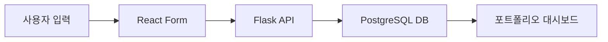

# 포트폴리오 관리 시스템 구현 가이드

## 개요
Next.js 프론트엔드와 Flask 백엔드를 활용한 포트폴리오 자산 관리 시스템 구현

## 시스템 아키텍처

### 데이터 흐름


### 기술 스택
- **Frontend**: Next.js 15.5.3, React, Tailwind CSS
- **Backend**: Python Flask, PostgreSQL (Neon.tech)
- **State Management**: React useState
- **API Communication**: Fetch API

## 구현 상세

### 1. PostgreSQL 데이터베이스 설계

#### 1.1 assets 테이블 구조
```sql
CREATE TABLE IF NOT EXISTS assets (
    id SERIAL PRIMARY KEY,
    asset_type VARCHAR(50),      -- 자산군 (주식, 채권, 크립토 등)
    name VARCHAR(100),           -- 자산명/종목명
    amount NUMERIC,              -- 총 보유금액
    quantity NUMERIC,            -- 보유수량 (주식/펀드/크립토)
    avg_price NUMERIC,           -- 매수평균가 (주식/펀드/크립토)
    eval_amount NUMERIC,         -- 평가금액 (부동산/채권)
    date DATE,                   -- 매수일/등록일
    note TEXT,                   -- 메모
    created_at TIMESTAMP DEFAULT CURRENT_TIMESTAMP
);
```

#### 1.2 자산군별 데이터 저장 전략
- **주식/펀드/크립토**: quantity + avg_price → amount 계산
- **부동산/채권**: principal(원금) + eval_amount(평가금액)
- **현금/계좌/증권/외화**: amount만 저장

### 2. Flask Backend API

#### 2.1 `/api/add-asset` 엔드포인트
```python
@app.route('/api/add-asset', methods=['POST'])
def add_asset():
    # JSON 데이터 수신 및 검증
    # PostgreSQL 저장
    # 성공/실패 응답 반환
```

#### 2.2 데이터 검증 로직
- **필수 필드**: assetType, name, date
- **자산군별 필수 필드**:
  - 주식/펀드/크립토: quantity, avgPrice
  - 부동산/채권: principal, evaluationAmount
  - 현금/계좌/증권/외화: amount

#### 2.3 응답 형식
```json
// 성공
{
  "status": "success",
  "message": "자산 저장 완료",
  "asset_id": 123
}

// 실패
{
  "status": "error",
  "message": "오류 메시지"
}
```

### 3. Next.js Frontend

#### 3.1 컴포넌트 구조
```
app/portfolio/
├── page.tsx                    # 포트폴리오 메인 페이지
└── components/
    ├── EnhancedPortfolioForm.tsx    # 향상된 입력 폼
    └── PortfolioDashboard.tsx       # 자산 현황 대시보드
```

#### 3.2 동적 폼 필드 시스템
```typescript
// 자산군별 조건부 렌더링
const showQuantityAndPrice = ['stock', 'fund', 'crypto'].includes(assetType);
const showPrincipalAndEvaluation = ['real-estate', 'bond'].includes(assetType);
const showOnlyAmount = ['cash', 'account', 'securities', 'foreign-currency'].includes(assetType);
```

#### 3.3 API 연동 로직
```typescript
const response = await fetch('http://localhost:5001/api/add-asset', {
  method: 'POST',
  headers: { 'Content-Type': 'application/json' },
  body: JSON.stringify(submitData),
});
```

### 4. 멀티페이지 네비게이션 시스템

#### 4.1 페이지 구조
- **홈 (`/`)**: 랜딩 페이지, 기능별 접근점
- **경제지표 (`/indicators`)**: 기존 경제지표 모니터링
- **포트폴리오 (`/portfolio`)**: 자산 관리 시스템

#### 4.2 전역 네비게이션
```tsx
// components/Navigation.tsx
- 모든 페이지에서 일관된 네비게이션 제공
- 현재 페이지 하이라이트
- 반응형 디자인
```

## 지원 자산군 (9가지)

| 자산군 | 필수 필드 | 계산 방식 |
|--------|-----------|-----------|
| 현금 | amount | 직접 입력 |
| 계좌 | amount | 직접 입력 |
| 증권 | amount | 직접 입력 |
| 주식 | quantity, avgPrice | amount = quantity × avgPrice |
| 펀드 | quantity, avgPrice | amount = quantity × avgPrice |
| 크립토 | quantity, avgPrice | amount = quantity × avgPrice |
| 채권 | principal, evaluationAmount | amount = evaluationAmount |
| 부동산 | principal, evaluationAmount | amount = evaluationAmount |
| 외화 | amount | 직접 입력 |

## 구현 검증

### 테스트 시나리오
1. **다양한 자산군 입력 테스트**
   - 주식: 수량 + 평균가 → 자동 총액 계산
   - 부동산: 원금 + 평가금액 입력
   - 현금: 보유금액만 입력

2. **API 연동 테스트**
   - 성공적인 데이터 저장 확인
   - 오류 처리 및 사용자 피드백

3. **UI/UX 검증**
   - 자산군별 동적 필드 전환
   - 반응형 레이아웃
   - 입력 유효성 검사

### 실행 환경
- **Frontend**: http://localhost:3000
- **Backend**: http://localhost:5001
- **Database**: Neon PostgreSQL (원격)

## 주요 개선사항

### Before (기본 폼)
- 단순한 텍스트 입력
- 자산군 구분 없음
- 로컬 상태 관리만

### After (향상된 시스템)
- 자산군별 특화 필드
- PostgreSQL 영구 저장
- 실시간 계산 기능
- 전문적인 포트폴리오 관리

## 관련 파일

### Backend
- `backend/services/postgres_database_service.py` - 자산 저장 메서드 추가
- `backend/app.py` - `/api/add-asset` 라우트 구현

### Frontend
- `frontend/src/components/EnhancedPortfolioForm.tsx` - 향상된 입력 폼
- `frontend/src/components/PortfolioDashboard.tsx` - 자산 현황 대시보드
- `frontend/src/app/portfolio/page.tsx` - 포트폴리오 메인 페이지
- `frontend/src/components/Navigation.tsx` - 전역 네비게이션

## 2025-09-20 업데이트: 포트폴리오 대시보드 시스템 완성

### 구현 완료 기능들

#### 1. 백엔드 API 확장
```python
# /api/portfolio 엔드포인트 추가
@app.route('/api/portfolio', methods=['GET'])
def get_portfolio():
    result = db_service.get_all_assets()
    return jsonify(result)

# PostgreSQL/SQLite 양쪽 모두 지원
def get_all_assets(self) -> Dict[str, Any]:
    # 자산 데이터 조회 + 자산군별 합계 + 비중 계산
    return {
        "data": assets,           # 개별 자산 목록
        "summary": summary,       # 전체 요약 (총자산, 원금, 손익, 수익률)
        "by_category": categories # 자산군별 합계 및 비중
    }
```

#### 2. 종합 대시보드 컴포넌트
- **요약 카드**: 총자산, 총원금, 총손익, 수익률 (그라데이션 색상)
- **차트 시각화**:
  - 도넛 차트: 자산군별 비중 (Recharts PieChart)
  - 막대 차트: 자산군별 금액 (Recharts BarChart)
- **종목별 테이블**: 9개 컬럼, 정렬/필터링 기능
- **실시간 연동**: 자산 추가 후 즉시 대시보드 새로고침

#### 3. 고급 기능들
```typescript
// 자산군별 필터링
const [selectedCategory, setSelectedCategory] = useState<string>('전체');

// 다중 정렬 옵션
const [sortBy, setSortBy] = useState<'amount' | 'profit_rate' | 'name'>('amount');
const [sortOrder, setSortOrder] = useState<'asc' | 'desc'>('desc');

// 통화 포맷팅
const formatCurrency = (amount: number) => {
  return new Intl.NumberFormat('ko-KR', {
    style: 'currency', currency: 'KRW'
  }).format(amount);
};
```

### 실제 데이터 검증
```bash
# 현재 포트폴리오 현황 (2025-09-20 기준)
curl http://localhost:5001/api/portfolio

{
  "summary": {
    "total_assets": 10993890.0,
    "total_principal": 10993890.0,
    "total_profit_loss": 0,
    "profit_rate": 0
  },
  "by_category": {
    "주식": {"total_amount": 5993890.0, "percentage": 54.52},
    "현금": {"total_amount": 5000000.0, "percentage": 45.48}
  }
}
```

### 주요 해결 이슈
1. **PostgreSQL RealDictRow 오류**: `result[0]` → `result['id']` 수정
2. **Next.js 캐시 문제**: `.next` 폴더 삭제 후 재시작으로 해결
3. **자산 추가 후 새로고침**: `key={refreshKey}` 방식으로 실시간 업데이트

## 향후 확장 계획
1. ✅ **포트폴리오 조회 API** - 완료 (`/api/portfolio`)
2. **자산 수정/삭제 기능** - CRUD 완성
3. ✅ **포트폴리오 분석** - 완료 (자산 비중, 수익률 계산)
4. ✅ **차트 시각화** - 완료 (자산 분포 도넛차트, 자산군별 막대차트)
5. **실시간 가격 연동** - 주식/크립토 현재가 조회
6. **수익률 추적** - 시간별 포트폴리오 가치 변화