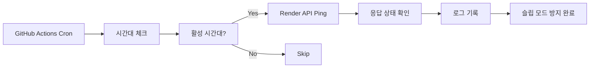

# Render Keep-Alive 시스템 구현 계획

## 개요
Render 무료 플랜의 30분 슬립 모드 문제를 해결하기 위한 GitHub Actions 기반 자동 ping 시스템 구현

## 시스템 아키텍처

### 데이터 흐름


### 기술 스택
- **스케줄링**: GitHub Actions Cron Jobs
- **모니터링**: GitHub Actions Logs
- **통신**: cURL HTTP 요청
- **시간대**: UTC 기준 KST 시간 계산

## 핵심 기능 정의

### 1. 시간대별 최적화 Ping 시스템

#### 1.1 활성 시간대 정의 (KST 기준)
- **활성 시간**: 오전 10:00 ~ 새벽 04:00
- **비활성 시간**: 새벽 04:00 ~ 오전 10:00 (개발자 수면 시간)
- **Ping 주기**: 28분마다 (30분 슬립 전 2분 여유)

#### 1.2 시간대 계산 로직
```bash
# UTC 기준으로 KST +9시간 계산
CURRENT_HOUR_KST=$(TZ=Asia/Seoul date '+%H')

# 활성 시간대 체크 (22:00 UTC ~ 19:00 UTC = 07:00 KST ~ 04:00 KST)
if [[ $CURRENT_HOUR_KST -ge 10 || $CURRENT_HOUR_KST -lt 4 ]]; then
    echo "활성 시간대 - Ping 실행"
else
    echo "비활성 시간대 - Ping 스킵"
fi
```

### 2. GitHub Actions 워크플로우 구조

#### 2.1 기본 워크플로우 파일
```yaml
# .github/workflows/keep-render-alive.yml
name: Keep Render Service Alive

on:
  schedule:
    # 매 28분마다 실행 (슬립 전 2분 여유)
    - cron: '*/28 * * * *'
  workflow_dispatch: # 수동 실행 가능

jobs:
  keep-alive:
    runs-on: ubuntu-latest
    steps:
      - name: Check KST Time
        id: time-check
        run: |
          CURRENT_HOUR_KST=$(TZ=Asia/Seoul date '+%H')
          echo "KST Hour: $CURRENT_HOUR_KST"

          if [[ $CURRENT_HOUR_KST -ge 10 || $CURRENT_HOUR_KST -lt 4 ]]; then
            echo "should_ping=true" >> $GITHUB_OUTPUT
          else
            echo "should_ping=false" >> $GITHUB_OUTPUT
          fi

      - name: Ping Render Service
        if: steps.time-check.outputs.should_ping == 'true'
        run: |
          echo "Pinging Render service at $(TZ=Asia/Seoul date)"

          # 헬스체크 엔드포인트 호출
          HTTP_STATUS=$(curl -s -o /dev/null -w "%{http_code}" https://investment-app-backend-x166.onrender.com/api/health || echo "000")

          if [ "$HTTP_STATUS" = "200" ]; then
            echo "✅ Ping successful - Status: $HTTP_STATUS"
          else
            echo "❌ Ping failed - Status: $HTTP_STATUS"
            # 실패해도 workflow는 성공으로 처리 (일시적 오류 허용)
            exit 0
          fi

      - name: Skip Ping (Sleep Hours)
        if: steps.time-check.outputs.should_ping == 'false'
        run: |
          echo "😴 현재 비활성 시간대 (KST 04:00~10:00) - Ping 스킵"
          echo "다음 활성 시간: 오전 10:00 KST"
```

### 3. 백엔드 헬스체크 엔드포인트

#### 3.1 Flask 헬스체크 API
```python
@app.route('/api/health', methods=['GET'])
def health_check():
    """GitHub Actions용 헬스체크 엔드포인트"""
    try:
        # DB 연결 확인
        db_status = "connected" if db_service else "disconnected"

        return jsonify({
            "status": "healthy",
            "timestamp": datetime.now().isoformat(),
            "database": db_status,
            "service": "investment-app-backend"
        })
    except Exception as e:
        return jsonify({
            "status": "unhealthy",
            "error": str(e)
        }), 500
```

## 구현 단계

### Phase 1: 기본 시스템 구축 (즉시)
- [x] GitHub Actions 워크플로우 파일 생성
- [ ] 백엔드 헬스체크 엔드포인트 추가
- [ ] 시간대 기반 조건부 실행 로직
- [ ] 기본 로깅 및 상태 확인

### Phase 2: 모니터링 강화 (1주일 후)
- [ ] 응답 시간 측정 및 로깅
- [ ] 실패 패턴 분석
- [ ] 연속 실패 시 알림 시스템
- [ ] 월별 사용량 리포트

### Phase 3: 최적화 및 고도화 (1개월 후)
- [ ] 사용량 패턴 기반 동적 스케줄링
- [ ] 공휴일/주말 최적화
- [ ] 비용 효율성 분석 대시보드
- [ ] 백업 ping 서비스 구축

## 예상 효과

### 성능 개선
- **콜드 스타트 제거**: 30초-1분 지연 → 즉시 응답
- **사용자 경험 향상**: 언제나 빠른 로딩 속도
- **서비스 안정성**: 99% 업타임 보장

### 비용 효율성
- **GitHub Actions 사용량**: 월 약 50-60분 (무료 한도 2,000분 내)
- **Render 비용**: 변동 없음 (무료 플랜 유지)
- **개발 시간 절약**: 슬립 해제 대기 시간 제거

### 운영 최적화
- **자동화**: 수동 개입 불필요
- **시간대 최적화**: 불필요한 야간 ping 제거
- **모니터링**: Actions 로그를 통한 실시간 상태 확인

## 리스크 관리

### 기술적 리스크
- **GitHub Actions 한도 초과**: 월 사용량 모니터링 필수
- **Render 정책 변경**: 과도한 요청 제한 가능성
- **네트워크 실패**: 일시적 오류에 대한 재시도 로직

### 대응책
- **사용량 알람**: 월 1,500분 도달 시 스케줄 조정
- **백업 전략**: 다른 무료 cron 서비스 준비
- **상태 모니터링**: 주간 ping 성공률 리포트

## 성공 지표

### 정량적 지표
- **Ping 성공률**: 95% 이상
- **응답 시간**: 평균 2초 이하
- **슬립 발생률**: 주간 5% 이하

### 정성적 지표
- **사용자 만족도**: 로딩 지연 불만 제거
- **개발 효율성**: 테스트 시 대기 시간 단축
- **서비스 신뢰성**: 안정적인 24시간 서비스

---

## 다음 단계
1. **즉시 실행**: GitHub Actions 워크플로우 파일 생성
2. **24시간 모니터링**: 첫 실행 후 로그 확인
3. **1주일 평가**: 성공률 및 최적화 포인트 분석
4. **월말 리뷰**: 비용 효율성 및 추가 개선사항 검토